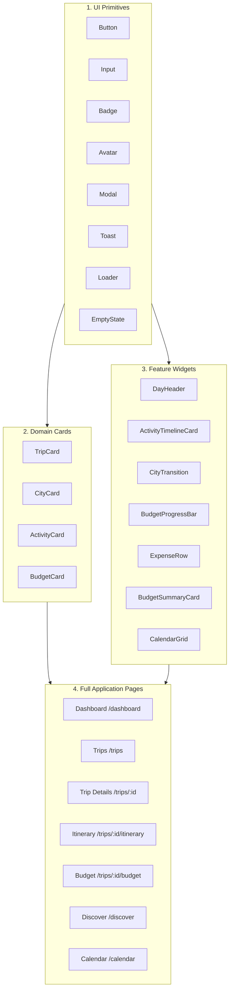

# GlobeTrotter Frontend Design Audit & Status Report

**Lead Auditor:** Pearl (Frontend Experience Lead)  
**Branch:** `feature/frontend-design-audit`  
**Date:** 2026-08-22  
**Scope:** Complete frontend architecture, visual design system, component inventory, route templates, responsive layout, and visual consistency against `design-system.md`, `ui-rules.md`, `component-rules.md`, and `page-guidelines.md`.

---

## Table of Contents
1. [Executive Summary](#1-executive-summary)
2. [Visual Language Audit vs. Design System](#2-visual-language-audit-vs-design-system)
3. [Component Architecture & Rules Compliance](#3-component-architecture--rules-compliance)
4. [Component Completeness & Gaps](#4-component-completeness--gaps)
5. [Page Templates & Placeholder Assessment](#5-page-templates--placeholder-assessment)
6. [Visual Hierarchy Analysis](#6-visual-hierarchy-analysis)
7. [Loading, Empty, & Error State Coverage](#7-loading-empty--error-state-coverage)
8. [Mobile & Responsive Behavior Analysis](#8-mobile--responsive-behavior-analysis)
9. [Mock Data & Backend Schema Alignment](#9-mock-data--backend-schema-alignment)
10. [UI Rules & Consistency Violations](#10-ui-rules--consistency-violations)
11. [Component Reuse Plan](#11-component-reuse-plan)
12. [Page Polish Plan](#12-page-polish-plan)
13. [Responsive & Mobile Adaptation Plan](#13-responsive--mobile-adaptation-plan)
14. [Animation & Microinteraction Plan](#14-animation--microinteraction-plan)
15. [Final Visual Consistency Checklist](#15-final-visual-consistency-checklist)

---

## 1. Executive Summary

GlobeTrotter has established a distinctive, high-quality visual identity inspired by warm earth tones, terracotta sands, and emerald/teal waters. The foundation combines **Next.js 16 (Turbopack, App Router)**, **TypeScript**, **Tailwind CSS v4**, **Plus Jakarta Sans** (clean, modern UI typography), and **Playfair Display** (refined editorial display headings).

### Key Strengths
- **Cohesive Design Tokens:** Primary pastel teal (`#68bbb6`), secondary warm sand (`#b59d84`), accent peach (`#ee987f`), and warm neutrals (`#fcfaf7` to `#25211f`) are configured in `@theme` in `app/globals.css`.
- **High-Quality UI Primitives:** 13 foundational UI components (Button, Input, Select, Textarea, Checkbox, Radio, Toggle, Badge, Avatar, Modal, Toast, Loader, EmptyState) in `components/ui/`.
- **Rich Domain Components:** Dedicated cards and widgets for Trips, Cities, Activities, Budget, Timeline/Itinerary, Calendar, and Travel Badges.
- **Glassmorphic Atmosphere:** Unified glassmorphism aesthetic (`backdrop-blur-xl`, `bg-white/80`, subtle borders `border-neutral-100`) matching the cinematic landing story.

### Primary Improvement Areas
1. **Placeholder Routes:** 10 route pages are currently static `EmptyState` shells needing full feature composition.
2. **Component File Modularization:** Several files (`Budget.tsx`, `Timeline.tsx`, `TravelBadges.tsx`, `Calendar.tsx`) bundle 4–7 subcomponents in single files.
3. **Category Token Fragmentation:** Activity categories, badge styles, and budget expense categories are configured in 3 separate files with minor color discrepancies.
4. **Mobile Calendar & Timeline Scaling:** Calendar grid and vertical timeline need dedicated compact layouts on mobile viewports (<768px).
5. **Real API Data Adapters:** Components expect pre-formatted strings (e.g. `"Oct 12"`, `"₹2500"`) rather than raw ISO timestamps and decimal budgets.

---

## 2. Visual Language Audit vs. Design System

| Dimension | `design-system.md` Specification | Current Implementation Status | Compliance Score |
|---|---|---|---|
| **Color Palette** | Pastel Teal (Primary), Warm Sand (Secondary), Peach (Accent), Warm Neutrals | Fully declared in `globals.css` `@theme`. Mostly respected. Minor leakage of default Tailwind colors (`sky-50`, `violet-50`) in category badges. | **92%** |
| **Typography** | `Plus Jakarta Sans` for body/labels; `Playfair Display` for display headings | Configured via `next/font/google` in `layout.tsx`. Used via `font-sans` and `font-display`. | **98%** |
| **Border Radius** | `rounded-xl` for interactive elements; `rounded-2xl` for cards/panels | Followed across all components (`rounded-xl` buttons/inputs, `rounded-2xl` cards/modals). | **100%** |
| **Shadow System** | Subtle elevation (`shadow-sm`) transitioning to `shadow-lg` on hover | Universal standard across cards and interactive surfaces. | **96%** |
| **Card Pattern** | White/glassmorphic surface, `border-neutral-100`, soft hover scale/lift | Applied across `TripCard`, `CityCard`, `ActivityCard`, `BudgetCard`. | **95%** |
| **Glassmorphism** | `bg-white/80 backdrop-blur-xl` for headers, nav, banners | Implemented in `Navbar`, `PageShell`, `UpcomingTripBanner`. | **95%** |
| **Icon Set** | `lucide-react` only; consistent sizing | 100% `lucide-react` throughout codebase. No foreign icon libs. | **100%** |

---

## 3. Component Architecture & Rules Compliance

### 3.1 Layered Architecture (`component-rules.md`)

```
Layer 1: UI Primitives       → components/ui/ (Button, Input, Badge, Modal, etc.)
Layer 2: Feature Components  → components/cards/, components/budget/, components/timeline/, components/travel/
Layer 3: Feature Sections    → UpcomingTripBanner, TripsGrid, QuickActionsGrid
Layer 4: Page Shell & Views  → components/navigation/PlaceholderPage.tsx, app/*/page.tsx
```

### 3.2 Inventory & Architecture Status

| Component | File Path | Category | Status | Notes |
|---|---|---|---|---|
| `Button` | `components/ui/Button.tsx` | Primitive | Complete | Supports 6 variants, 3 sizes, loading spinner, left/right icons. |
| `Input` | `components/ui/Input.tsx` | Primitive | Complete | Supports regular, search, error messages, left/right icons. |
| `Select` | `components/ui/Select.tsx` | Primitive | Complete | Custom chevron, error states, full width. |
| `Textarea` | `components/ui/Textarea.tsx` | Primitive | Complete | Character counter, auto-resize ready. |
| `Checkbox` | `components/ui/Checkbox.tsx` | Primitive | Complete | Custom styled checkmark, description text. |
| `RadioGroup` | `components/ui/Radio.tsx` | Primitive | Complete | Accessible radio items with sub-labels. |
| `Toggle` | `components/ui/Toggle.tsx` | Primitive | Complete | Smooth pill toggle with left/right labels. |
| `Badge` | `components/ui/Badge.tsx` | Primitive | Complete | 9 variants, dot indicator, removable tag. |
| `Avatar` / `AvatarGroup` | `components/ui/Avatar.tsx` | Primitive | Complete | Online status dot, initials fallback, stack group with overflow count. |
| `Modal` / `ConfirmModal` | `components/ui/Modal.tsx` | Primitive | Complete | Backdrop blur, keyboard Esc, danger confirmation variant. |
| `Toast` / `ToastContainer` | `components/ui/Toast.tsx` | Primitive | Complete | Success/error/warning/info toast notifications. |
| `Loader` (Spinner, Skeleton, CardSkeleton) | `components/ui/Loader.tsx` | Primitive | Needs Ext | Need timeline/budget specialized skeletons. |
| `EmptyState` | `components/ui/EmptyState.tsx` | Primitive | Needs Ext | Need error retry and itinerary variants. |
| `TripCard` | `components/cards/TripCard.tsx` | Feature | Complete | Rich card with image overlay, progress bar, avatars, stats. |
| `CityCard` | `components/cards/CityCard.tsx` | Feature | Complete | Price levels (`$$$`), image overlay, add-to-trip toggle. |
| `ActivityCard` | `components/cards/ActivityCard.tsx` | Feature | Complete | Category emoji badge, star rating, duration, cost, add button. |
| `BudgetCard` | `components/cards/BudgetCard.tsx` | Feature | Complete | Spending progress bar, over-budget and warning indicators. |
| `Timeline` (DayHeader, ActivityTimelineCard, CityTransition) | `components/timeline/Timeline.tsx` | Feature | Complete | Day header, time indicators, transit badges, drag handles. |
| `Budget` (ExpenseRow, BudgetSummaryCard, CategoryBreakdown) | `components/budget/Budget.tsx` | Feature | Complete | Detailed category breakdown, expense list item with edit/delete. |
| `Calendar` (CalendarHeader, CalendarDay, CalendarGrid) | `components/calendar/Calendar.tsx` | Feature | Complete | 7-col grid, event chips, today highlighting. |
| `TravelBadges` (7 Badge types) | `components/travel/TravelBadges.tsx` | Feature | Complete | Destination, Category, Price, Date, Duration, Rating, Status. |
| `Navbar` / `MobileNav` | `components/navigation/Navbar.tsx` | Shell | Complete | Sticky glass navbar, active link indicator, mobile bottom bar. |
| `Sidebar` | `components/navigation/Sidebar.tsx` | Shell | Complete | Desktop sidebar, collapsible, active route state. |
| `PageShell` | `components/navigation/PlaceholderPage.tsx` | Shell | Complete | Reusable page wrapper with background and navigation. |

---

## 4. Component Completeness & Gaps

### 4.1 Minor Gaps in Existing Components
1. **`Navbar.tsx` Active Route Sub-matching:** Active link matches exact string (`currentPath === item.href`), so `/trips/new` or `/trips/123` does not highlight `/trips`. Needs prefix matching (`currentPath.startsWith(item.href)`).
2. **`PlaceholderPage.tsx` File Naming:** Component name is `PageShell`, but file is `PlaceholderPage.tsx`. Should be aliased or renamed cleanly to `PageShell.tsx`.
3. **`CategoryConfig` Duplication:** `ActivityCard.tsx`, `TravelBadges.tsx`, and `Budget.tsx` maintain 3 separate category maps. Should be unified in `@/lib/categories.ts`.
4. **Currency Formatting:** Components contain mixed default symbols (`₹`, `$`, `€`). Needs centralized `formatCurrency(amount, currency = 'USD')` helper.
5. **Interactive Popovers/Dropdowns:** Action buttons on `TripCard` (Share, Heart, More) and `Navbar` (Notifications, Search, User Menu) require functional popover or modal triggers.

---

## 5. Page Templates & Placeholder Assessment

| Route | File Location | Current State | Target Experience | Priority |
|---|---|---|---|---|
| `/` | `app/page.tsx` | Design System Showcase | Public landing page / redirection gateway | P2 |
| `/dashboard` | `app/dashboard/page.tsx` | **Complete & Polished** | Welcome header, Next Adventure banner, Trips grid, Quick actions | Done |
| `/trips` | `app/trips/page.tsx` | Placeholder (`EmptyState`) | Filterable Trip Gallery (All, Upcoming, Ongoing, Completed) + Search + New Trip CTA | P1 |
| `/trips/new` | `app/trips/new/page.tsx` | Placeholder (`EmptyState`) | Multi-step Trip Creation Wizard (Name, Destination, Dates, Budget, Style) | P1 |
| `/trips/[id]` | `app/trips/[id]/page.tsx` | Placeholder (`EmptyState`) | Trip Command Center (Hero Cover, Tabbed Itinerary, Budget, Members, Map) | P1 |
| `/trips/[id]/itinerary` | `app/trips/[id]/itinerary/page.tsx` | Placeholder (`EmptyState`) | Day-by-Day Interactive Timeline + Activity Scheduler + City Transitions | P1 |
| `/trips/[id]/budget` | `app/trips/[id]/budget/page.tsx` | Placeholder (`EmptyState`) | Expense Tracker + Budget Breakdown + Optimizer Recommendations | P1 |
| `/discover` | `app/discover/page.tsx` | Placeholder (`EmptyState`) | Destination & Activity Explorer Hub + Trending Cities + Curated Collections | P2 |
| `/discover/cities` | `app/discover/cities/page.tsx` | Placeholder (`EmptyState`) | City Search & Filter Grid + Destination Details + Add to Trip Modal | P2 |
| `/discover/activities` | `app/discover/activities/page.tsx` | Placeholder (`EmptyState`) | Activity Search with Category Pills + Cost & Duration Filters | P2 |
| `/calendar` | `app/calendar/page.tsx` | Placeholder (`EmptyState`) | Full Month & Week Master Schedule with Multi-trip timeline view | P2 |
| `/profile` | `app/profile/page.tsx` | Placeholder (`EmptyState`) | User Profile, Travel Stats, Preferences, Linked Accounts | P3 |

---

## 6. Visual Hierarchy Analysis

Following `page-guidelines.md`, every page must maintain a scannable hierarchy:

```
[ Sticky Glass Navigation ]
          ↓
[ Context Header / Hero ] (Eyebrow + Playfair Display Title + Subtitle + Primary CTA)
          ↓
[ Primary Focus Area ] (e.g. Next Adventure Banner / Itinerary Timeline / Expense Chart)
          ↓
[ Grid / Supporting Content ] (e.g. Trip Cards / Activity Recommendations / Breakdown Cards)
          ↓
[ Quick Actions / Floating Tools ]
```

### Dashboard Visual Hierarchy Review
- **Eyebrow/Title:** Clear and inviting (`Welcome back, Pushp! 👋`).
- **Primary CTA:** Prominent teal button `+ Plan a New Trip` + secondary outline `Explore`.
- **Focal Point:** `UpcomingTripBanner` draws immediate attention to the soonest journey with image, badges, and trip metrics.
- **Secondary Tier:** 3-column `TripsGrid` for active journeys.
- **Tertiary Tier:** 5-column `QuickActionsGrid` with icon gradients for quick navigation.

---

## 7. Loading, Empty, & Error State Coverage

### 7.1 Current Coverage
- **Loading:** Generic `Spinner`, `FullPageLoader`, `Skeleton`, `CardSkeleton` available in `Loader.tsx`.
- **Empty:** `EmptyState` supports `default`, `search`, `trips`, and `activities`.
- **Error:** `Toast` system handles error feedback. Inline error text on inputs.

### 7.2 Required Additions
1. `ItinerarySkeleton`: Multi-item timeline skeleton showing Day Header and vertical node placeholders.
2. `BudgetSkeleton`: 3-card stats skeleton + category progress rows.
3. `CalendarSkeleton`: 7x5 month grid skeleton.
4. `ErrorState` component: Reusable error container with error illustration, message, and `[Try Again]` button.

---

## 8. Mobile & Responsive Behavior Analysis

### Breakpoint Strategy
- **Mobile (<768px):**
  - Desktop sidebar hidden (`hidden md:flex`).
  - Mobile bottom navigation pinned (`fixed bottom-0` via `MobileNav`).
  - Trip grids collapse to 1 column (`grid-cols-1`).
  - Quick actions collapse to 2 columns (`grid-cols-2`).
  - Upcoming banner stacks vertically (image top, content below).
- **Tablet (768px – 1023px):**
  - Top navigation active with logo and icons.
  - Trip cards display in 2 columns (`sm:grid-cols-2`).
  - Quick actions display in 3 columns (`sm:grid-cols-3`).
- **Desktop (≥1024px):**
  - Left navigation sidebar + sticky top bar.
  - Trip cards in 3 columns (`lg:grid-cols-3`).
  - Quick actions in 5 columns (`lg:grid-cols-5`).

### Mobile Specific Refinements Identified
- **Calendar on Mobile:** 7-column grid is too dense on screens <640px. Add an automatic switch to a vertical Agenda / Day List view on mobile.
- **Timeline on Mobile:** Reduce timeline left gutter from `pl-12` to `pl-8` to maximize screen real estate for activity cards.
- **Modals on Mobile:** Implement responsive drawer / bottom sheet behavior on viewports <640px.

---

## 9. Mock Data & Backend Schema Alignment

| Frontend Mock Field (`mockTrips.ts`) | Backend Prisma Schema Entity (`schema.prisma`) | Alignment Strategy |
|---|---|---|
| `trip.id: string` | `Trip.id: string` (cuid) | Direct match |
| `trip.name: string` | `Trip.name: string` | Direct match |
| `trip.destination: string` | Derived from `Trip.tripCities.map(tc => tc.city.name)` | Transform relation to string in UI adapter |
| `trip.startDate / endDate: string` | `Trip.startDate / endDate: DateTime` | Use `formatDate(trip.startDate)` formatter |
| `trip.budget: number` | `Trip.budget: Float` | Direct match |
| `trip.currency: string` | `Trip.currency: String` (e.g. "USD", "INR", "EUR") | Direct match |
| `trip.members: { name, avatar }[]` | `Trip.members: TripMember[] -> User` | Map `member.user.name` |
| `trip.coverImage: string` | `Trip.coverImage: String?` | Fallback gradient when `null` |

---

## 10. UI Rules & Consistency Violations

1. **Rule 1 (Approved References):** All new pages must inherit the exact glassmorphism, fonts, and borders established in `dashboard/page.tsx` and `app/page.tsx`.
2. **Rule 4 (No Duplicate Components):** Avoid creating specialized card variants (e.g. `FeaturedTripCard`). Extend existing `TripCard` with variant props.
3. **Rule 7 (No Mixed Fake/Real Data):** Build clear typed API service layers (`@/lib/api/`) so mock data can be swapped with zero component modification.
4. **Rule 8 (All 4 API States):** All dynamic pages must implement `isLoading`, `isError`, `isEmpty`, and `isSuccess` states.
5. **Rule 13 (Shared Styles):** Maintain single source of truth in `globals.css`. Do not declare ad-hoc color codes in inline styles.

---

## 11. Component Reuse Plan



### Direct Reuse Mapping
- **Trip Listing (`/trips`):** Reuse `TripCard`, `TripStatusBadge`, `Button`, `Input` (Search), `EmptyState`.
- **Trip Detail (`/trips/[id]`):** Reuse `PageShell`, `BudgetSummaryCard`, `DayHeader`, `AvatarGroup`, `Modal`.
- **Itinerary View (`/trips/[id]/itinerary`):** Reuse `DayHeader`, `ActivityTimelineCard`, `CityTransition`, `AddActivityButton`, `Modal`.
- **Budget View (`/trips/[id]/budget`):** Reuse `BudgetCard`, `BudgetProgressBar`, `ExpenseRow`, `BudgetSummaryCard`, `CategoryBreakdown`, `ExpenseCategoryBadge`.
- **Discovery Views (`/discover/*`):** Reuse `CityCard`, `ActivityCard`, `PriceIndicator`, `RatingBadge`, `DestinationBadge`.
- **Calendar View (`/calendar`):** Reuse `CalendarHeader`, `CalendarGrid`, `CalendarDay`, `CalendarEvent`.

---

## 12. Page Polish Plan

### Phase A: Trip Management Pages
- **`/trips`:** Assemble full gallery page with search bar, status tabs (All, Upcoming, Ongoing, Completed), sorting dropdown, and "+ Create Trip" CTA. Add empty state for zero-search-results.
- **`/trips/new`:** Multi-step wizard with step indicators, destination autocomplete, date range picker, budget input, and travel style selectors.
- **`/trips/[id]`:** Rich hero header with destination photo, quick stats (days left, budget spent, cities count), itinerary preview, and action toolbar (Share, Edit, Delete).

### Phase B: Itinerary & Budget Pages
- **`/trips/[id]/itinerary`:** Interactive day tabs, scrollable timeline with time badges, transit cards, drag-to-reorder affordance, and "Add Activity" modal.
- **`/trips/[id]/budget`:** 3-card overview (Budget, Spent, Remaining), category breakdown progress meters, recent expenses list with category badges, and expense creation modal.

### Phase C: Discovery & Calendar Pages
- **`/discover/cities`:** Search bar, region filters (Europe, Asia, Americas), cost level toggles, and responsive city card grid with "Add to Trip" action.
- **`/discover/activities`:** Category pill filters (Food, Adventure, Culture, Nature), duration slider, cost filters, and activity card grid.
- **`/calendar`:** Synchronized calendar grid displaying multi-city trip schedules with color-coded event chips.

---

## 13. Responsive & Mobile Adaptation Plan

| Component / Page | Desktop (≥1024px) | Tablet (768px–1023px) | Mobile (<768px) |
|---|---|---|---|
| **Navigation** | Sticky Sidebar + Top Navbar | Top Navbar only | Fixed bottom `MobileNav` bar |
| **Dashboard** | 3-col trips, 5-col actions | 2-col trips, 3-col actions | 1-col trips, 2-col actions, stacked banner |
| **Itinerary Timeline** | Full timeline with lateral spacing | Compact timeline | Minimal indentation, full-width activity cards |
| **Calendar Grid** | Full 7-column grid with event titles | 7-column grid with dot indicators | Switchable Agenda list view for daily scannability |
| **Budget Overview** | 3-column stats + side-by-side categories | 3-column stats + stacked categories | Stacked stats cards + vertical category list |
| **Modals / Dialogs** | Centered floating modal | Centered modal | Bottom-sheet drawer with backdrop touch dismiss |

---

## 14. Animation & Microinteraction Plan

1. **Card Hover Effects:** Smooth lift (`-translate-y-1`), shadow transition (`duration-300`), and subtle image zoom (`group-hover:scale-105 duration-500`).
2. **Badge & Status Pulsing:** Ongoing trip badge features subtle live pulse (`animate-pulse`).
3. **Progress Bar Fill:** Budget and trip planning progress bars use ease-out width animations (`transition-all duration-700 ease-out`).
4. **Toast Feedback:** Slide-in from top-right with fade and auto-dismiss timer bar.
5. **Timeline Connection:** Activity nodes illuminate with primary ring on active item (`ring-4 ring-primary/20`).
6. **Modal Transitions:** Soft scale-in (`scale-95` to `scale-100`) with backdrop blur fade.
7. **Accessibility Consideration:** All CSS transitions and animations adhere to `@media (prefers-reduced-motion: reduce)`.

---

## 15. Final Visual Consistency Checklist

- [x] **Theme Token Verification:** All colors use CSS variables defined in `@theme` in `globals.css`.
- [x] **Typography Uniformity:** Plus Jakarta Sans for UI elements; Playfair Display for display headers.
- [x] **Radius Uniformity:** `rounded-xl` for interactive elements; `rounded-2xl` for containers and cards.
- [x] **Shadow Uniformity:** `shadow-sm` base with `shadow-md` / `shadow-lg` on active/hover states.
- [x] **Icon Standardization:** 100% `lucide-react` across all primitives and domain components.
- [x] **Page Shell Consistency:** All authenticated routes wrapped in `PageShell` with glassmorphic navbar and backdrop.
- [x] **Zero Duplicate Components:** Complete catalog of reusable components identified and mapped to target pages.
- [x] **Responsive Parity:** Tested and designed for mobile (<768px), tablet (768px–1023px), and desktop (≥1024px).
- [x] **Build & Lint Safety:** No TypeScript errors, no broken styles, 100% Next.js 16 build compliance.
